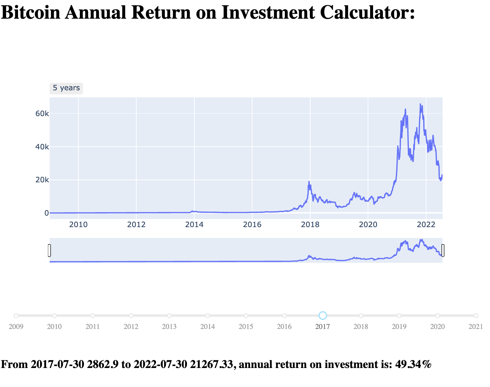

# Bitcoin annual returns:
This simple Python script shows the average annual bitcoin price performance (yearly percentage change). 

The calculation used is `yearly_performance = nth_root_of(current_price/historic_price)`

Demo:

The slider can be adjusted to see, how the annual return goes down over time. 

The script requires pandas, dash and plotly packages.

For a local copy: `git clone https://github.com/dancodery/bitcoin-annual-returns.git`

Please give me a star if you like this repo ;=)

Daniel Gockel © daniel@gockel.co
